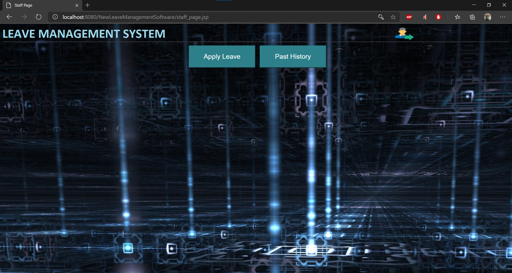

# Leave Management Software
It was one of my college projects which I developed in the third year.
It is a software for a college or university with different departments.
Here the professors/associate professor can apply for leave which will directly be forwarded to their respective head of department.
The Head of Department can review their application and react on it by accepting it or declining the application.
This helps the staff members to easily apply for leaves and keep track of their available leaves, and the past leaves which were granted or rejected.
It also helps the head of department by letting him react to the leave applied by the staff members in his/her department.

## Problem Description
In my college we found that for applying the professors had only two options which were either by mail or by a written application.
In both of these options it was very hard to keep track of the number of leave applied. Also, which of them were granted and which were rejected.
This is where this software comes in the picture, it gives a platform for the professors to keep track of their leaves.
It smoothens the process of leave application for them and also the granting option for their head of department.

## Functionality and Features
Basically there are 3 major actors in the picture which are:

* Admin
* Head of Department
* Staff Members

### Admin
There is one admin which is pre-registered directly in the database, and his/her role of admin is pretty generic.
This is done so no one can register for an admin role.
Since no one can directly become the head of the department, it's the job of the admin to register the head of department for each department.
He/She can view all the staff members registered and the head of the departments for each department. 
Also, the removal of any staff member or any head of the department can be done with the admin account.

### Head of Department
Every department has its own head and there can only be one head of the department at a point of time.
Head of the Department is responsible for all the leaves for evey staff member in that department.
He/She can view the staff members registered in that department.
The leave application directly appears on his home screen whenever any new application is submitted.
It stays on the there until it is answered i.e. either accepted or rejected.
With the pending leaves that need attention, the head of department can also view who is on leave on that day.

### Staff Members
Staff Member is either the professor or the associate professor in a department. 
A staff member can directly register using the signup page specifying the department where he/she works.
They have a limited number of leaves associated with them for specific categories. 
For the proper management they can view the number of leaves remaining, with the past history of their applications.
They are required to submit a replacement for them on the day they are off of their department.
After applying for a leave they can edit their application until it is finally submitted. 
The applied leaves directly goes to their respective head of department for the approval. 
Only on the approval their leave count is changes, otherwise it is left untouched.

## Screenshots of Working Project
### Login Page
***

### SignUp Page
***

### Admin Home Page
***

### Admin Adding a Head of Department
***

### Admin Viewing Staff Members
***

### Admin Deleting Staff Members
***

After Deleting the staff Member, he/she can't be seen in the `view staff` option in admin

### Staff Member Home Screen
***

### Staff Member Apply Leave Tab
***

After applying for the leave, there is an intermediate page in between to confirm that the application is correctly completed and they don't want to change anything

### Staff Member Past History Tab
***
Past History tab open with no previous records

Past History tab open with pending previous application

Past History tab open with accepted previous application

Past History tab open with declined previous application

### Staff Member Profile
***

### Head of Department Home Screen
***
Head of Departments Home Screen with no pending leave and no one on leave on today's date

Head od Departments home page with a pending request for leave applied by a staff member

After granting the leave to the staff member, we can check that the count for number of leaves taken is updated in the profile section of the staff.

### Head of Departments Profile
***

## Database Design
I have used MySQL for this project. Although, the implementation was not the most perfect one, the database design deosnt colide with itself and functions properly.
There is scope to improve the database design, but for this project we went with a simple and basic approach.
There are in total 6 tables for this project. I have described them below:

* admin (Admin account credentials) The admin already has an account. 

  | Column Name | Data Type | Length | Key | 
  |-------------|:----------|:-------|:----|
  |uname        | varchar   | 120    | PK  |
  |pwd          | varchar   | 120    |     |

* login_h (Head of Department Info)

  | Column Name | Data Type | Length | Key | 
  |-------------|:----------|:-------|:----|
  |name         | varchar   | 120    |     |
  |desg         | varchar   | 120    |     |
  |dept         | varchar   | 120    |     |
  |qual         | varchar   | 120    |     |
  |addr         | varchar   | 240    |     |
  |email        | varchar   | 120    |     |
  |phone        | varchar   | 120    |     |
  |uname        | varchar   | 120    | PK  |
  |pwd          | varchar   | 120    |     |

* login_s (Staff Member login Info)

  | Column Name | Data Type | Length | Key | 
  |-------------|:----------|:-------|:----|
  |uname        | varchar   | 120    | PK  |
  |pwd          | varchar   | 120    |     |

* staff_r (Staff Members Info)

  | Column Name | Data Type | Length | Key | 
  |-------------|:----------|:-------|:----|
  |sid          | integer   | 30     | PK  |
  |name         | varchar   | 120    |     |
  |desg         | varchar   | 120    |     |
  |dept         | varchar   | 120    |     |
  |qual         | varchar   | 120    |     |
  |syb_c        | integer   | 30     |     |
  |addr         | varchar   | 240    |     |
  |email        | varchar   | 120    |     |
  |phone        | varchar   | 120    |     |
  |uname        | varchar   | 120    | PK  |
  |pwd          | varchar   | 120    |     |
  |m_cnt        | integer   | 30     |     |
  |c_cnt        | integer   | 30     |     |

* app_leave (Staff Member Currently Unanswered Leaves Info)
  
  | Column Name | Data Type | Length | Key | 
  |-------------|:----------|:-------|:----|
  |sid          | integer   | 30     | PK  |
  |name         | varchar   | 120    |     |
  |date_f       | date      |        |     |
  |date_t       | date      |        |     |
  |cat          | varchar   | 120    |     |
  |reas         | varchar   | 240    |     |
  |alt_s        | varchar   | 120    |     |

* past_h (Staff Member's Past Leaves Info)
  
  | Column Name | Data Type | Length | Key |
  |-------------|:----------|:-------|:----|
  |sid          | integer   | 30     | PK  |
  |name         | varchar   | 120    |     |
  |date_f       | date      |        |     |
  |date_t       | date      |        |     |
  |cat          | varchar   | 120    |     |
  |reas         | varchar   | 240    |     |
  |alt_s        | varchar   | 120    |     |
  |status       | varchar   | 120    |     |

## File Structure and Flow of Events
There are a total of 23 jsp files and 4 html file. 
It can be hard to figure out which file is called when and to keep a track of files.
That's why I have added a diagram of the flow the files which is followed by this project.

### Thank You

This was one my first team project. I learned a lot about teamwork and also how to work with jsp and servlet.
I used many languages which were HTML, CSS, JAVA, JSP, and SQL.
I also learned how to work with Tomcat Server.

My Teammates:
* Pritesh Jadhav
* Vishal Kharde
* Amit Khachane

Thank You
